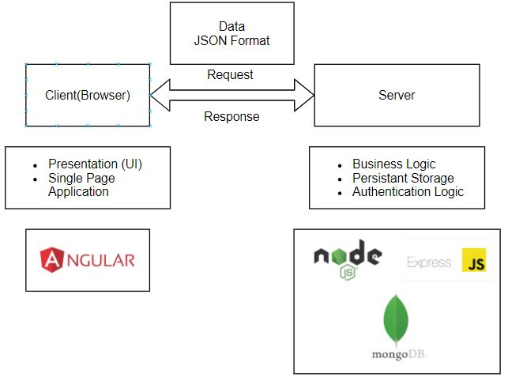

# Introduction

------

## What is MEAN?

1. Set of 4 technologies
2. **M**ongoDB, **E**xpress, **A**ngular, **N**ode.js
3. MongoDB as database
4. Angular for client side application development (frontend)
5. Node.js and Express as a Server side development (backend)
6. Express is the framework for Node.js to develop backend 

## What is Node.js?

1. A server side Library, which makes possible to implement server side application using JS
2. Node.js mainly perform following tasks on backend
   1. Listen to Requests and Send Response
   2. Execute Server-side Logic
   3. Interact with Databases and Files
3. Node.js is an alternative to PHP, Ruby on Rails, Java etc. 
4. Node.js rarely used Standalone, and mostly used with some framework
5. Express is one such framework

## What is Express?

1. An Express is a framework for Node.js which simplifies writing Server-Side Code and Logic
2. It offers additional functionalities to the Node.js 
3. It is a Middleware-based: Funnel Requests through Functions
4. The incoming request from the frontend to backend is funneled through various steps, where you can access the request and perform tasks over it
5. The task can be user authentication check, database updates or send back the response etc.
6. It includes routing, view-rendering and more
7. Express simplifies the usage of Node while developing backend

## What is MongoDB?

1. Provide the link of MongoDB tutorial here

## How Does the MEAN Stack works?

1. Refer following diagram

   

## Installation

1. Install Node.js (fronend + backend)
2. Install Angular CLI(frontend)
3. ....